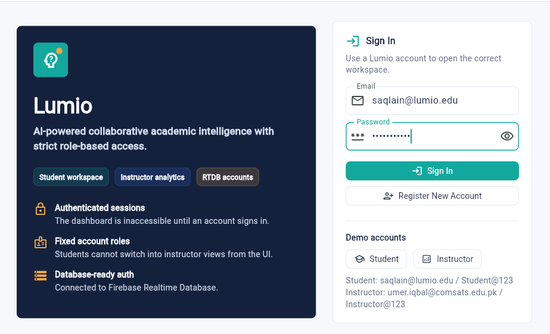
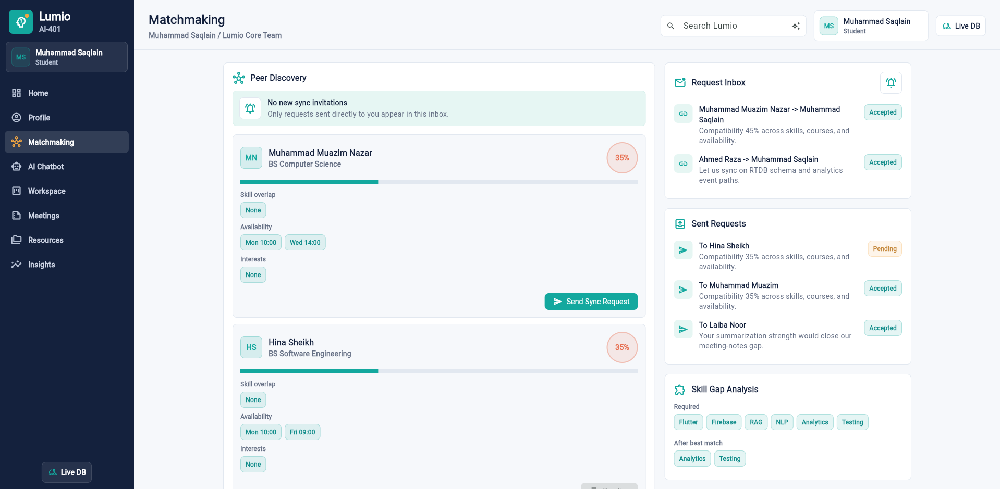
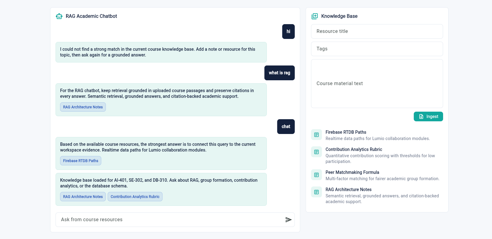
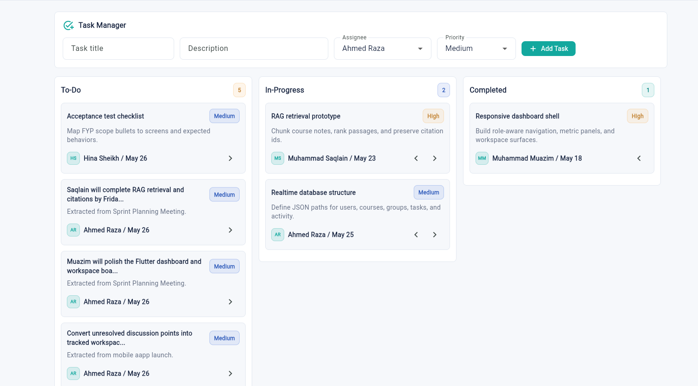
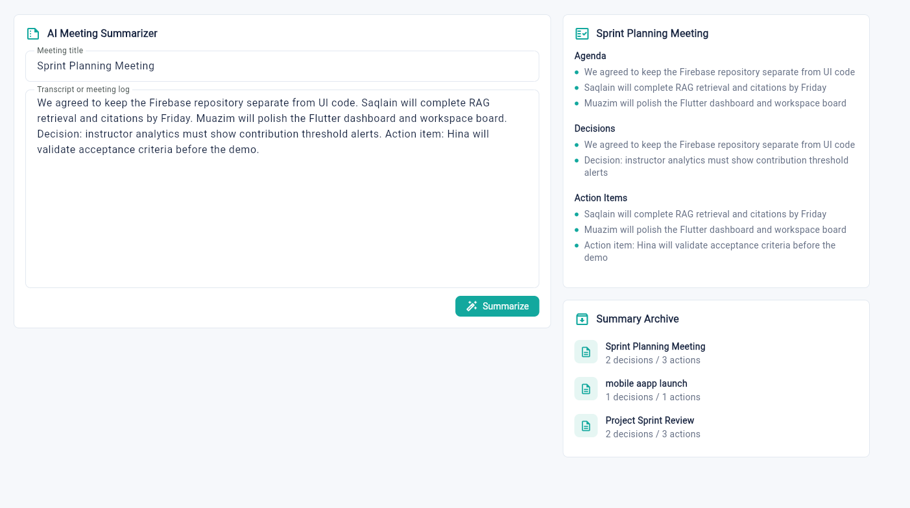
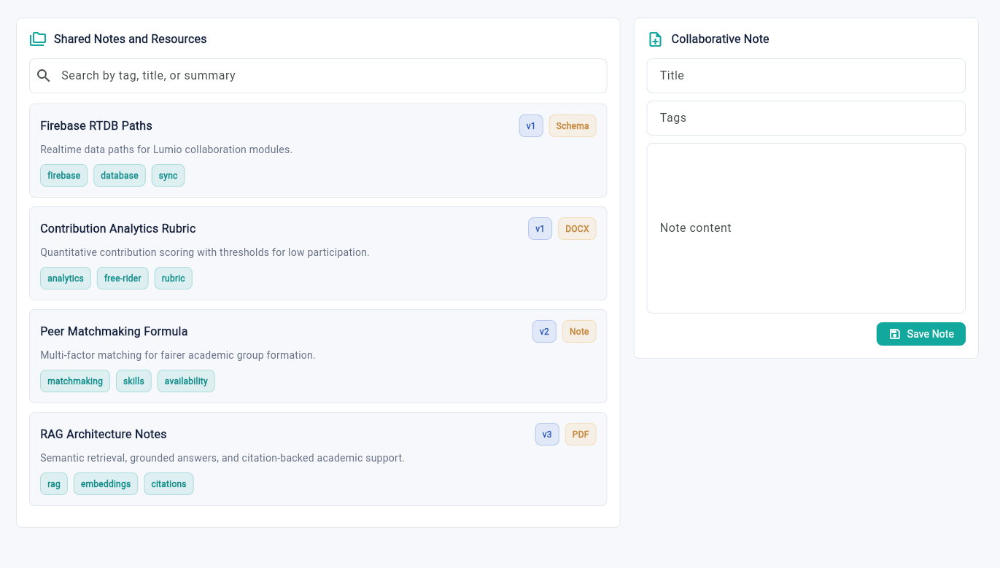
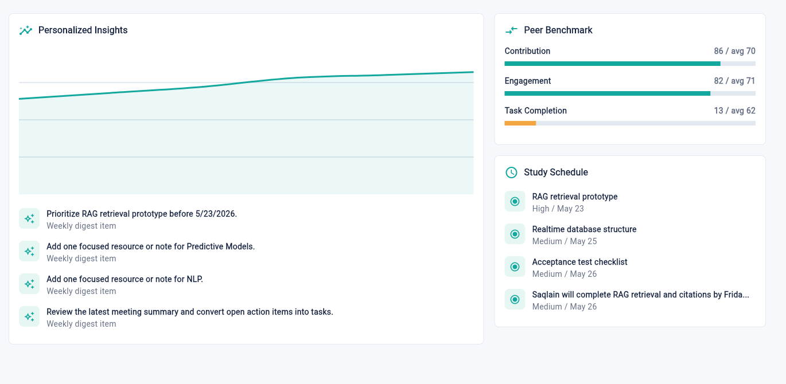

# Lumio — AI-Powered Collaborative Academic Intelligence Platform

<p align="center">
  <b>An intelligent academic collaboration platform powered by Generative AI, RAG, and predictive analytics.</b>
</p>


## 📌 Overview

Lumio is an AI-powered academic intelligence platform designed to improve student collaboration, learning efficiency, and instructor monitoring.

The platform combines **Generative AI, Retrieval-Augmented Generation (RAG), recommendation systems, and analytics** to create a smarter academic environment where students can collaborate, receive personalized guidance, and improve their learning outcomes.


## ✨ Key Features

### 🔐 Authentication & Role-Based Access

* Authentication-first application flow
* Student and instructor role management
* Personalized dashboards
* Profile management and visibility controls

<p align="center">
  
</p>

### 🤝 AI-Powered Peer Matchmaking

* Smart compatibility scoring
* Skill-gap analysis
* Student collaboration recommendations
* Team synchronization requests



### 💬 AI Academic Assistant (RAG-Based)

* Course-aware AI chatbot
* Retrieval-Augmented Generation architecture
* Context-aware academic responses
* Knowledge retrieval from academic resources



### 📋 Collaborative Workspace

* Kanban task management
* Task assignment and tracking
* Priority management
* Deadlines and team activity monitoring



### 📝 AI Meeting Intelligence

* Automated meeting summaries
* Decision extraction
* Action item generation
* Task extraction from discussions



### 📚 Smart Knowledge Management

* Shared notes and resources
* Categorization with tags
* AI-generated summaries
* Version tracking

---

### 📊 Academic Analytics & Prediction

* Student engagement monitoring
* Personalized study recommendations
* Instructor contribution analytics
* Free-rider detection
* Risk identification and intervention recommendations



# 🧠 Artificial Intelligence Components

Lumio integrates multiple AI-driven capabilities:

* Generative AI assistants
* Retrieval-Augmented Generation (RAG)
* Recommendation systems
* Predictive engagement analysis
* Natural Language Processing


# 🏗️ System Architecture

```
                User
                 |
                 |
          Flutter Application
                 |
        ---------------------
        |                   |
 Firebase Services      AI Services
        |                   |
 Realtime Database       RAG Pipeline
                            |
                    Knowledge Resources
```

---

# 🛠️ Technology Stack

## Frontend

* Flutter
* Dart

## Backend & Database

* Firebase Realtime Database
* Firebase Authentication

## Artificial Intelligence

* Generative AI
* Retrieval-Augmented Generation
* Recommendation Algorithms
* Predictive Analytics

## Development Tools

* Git
* GitHub
* Flutter SDK

---

# 📂 Project Structure

```
lumio-ai-academic-platform

├── lib/
│   ├── core/
│   ├── data/
│   ├── features/
│   └── main.dart
│
├── test/
├── docs/
├── web/
├── android/
├── windows/
│
├── pubspec.yaml
├── README.md
└── LICENSE
```

---

# ⚙️ Installation

## Prerequisites

Make sure you have:

* Flutter SDK installed
* Dart SDK installed
* Firebase configured

Check Flutter:

```bash
flutter doctor
```

---

## Clone Repository

```bash
git clone https://github.com/MuazamNazar/lumio-ai-academic-platform.git

cd lumio-ai-academic-platform
```

---

## Install Dependencies

```bash
flutter pub get
```

---

## Run Application

For web:

```bash
flutter run -d chrome
```

Build production web version:

```bash
flutter build web
```

---

# 🧪 Testing

Run static analysis:

```bash
flutter analyze
```

Run tests:

```bash
flutter test
```

---

# 🚀 Future Improvements

Planned improvements:

* Advanced LLM integration
* Real-time collaborative editing
* Mobile deployment
* Enhanced recommendation models
* More intelligent academic prediction systems

---

# 👨‍💻 Developer

Built as an AI-powered academic intelligence platform combining modern application development with Artificial Intelligence.
